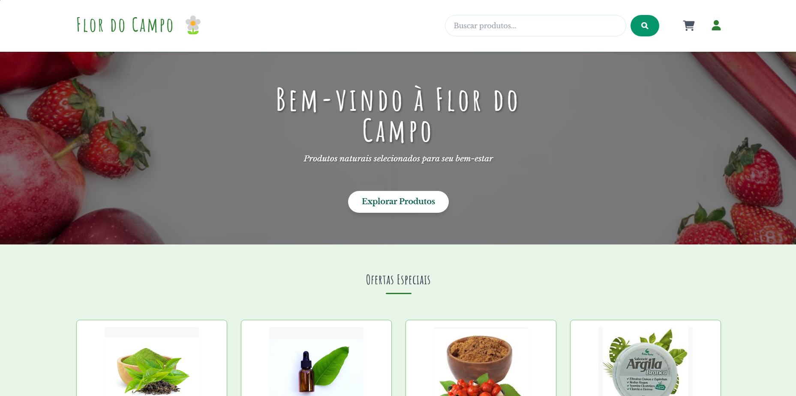

# Flor do Campo 🌼

> E-commerce de produtos naturais e orgânicos


## Preview do Projeto

<p align="center">  
</p>


## 👥 Participantes do Projeto

- Vinícius Ares Monteiro de Lima
- Maria Laura
- Lucas Moura


## 🚀 Tecnologias Utilizadas

- **Vite**: Build tool e servidor de desenvolvimento
- **TailwindCSS**: Framework CSS utilitário
- **JavaScript ES6+**: Vanilla JavaScript moderno
- **Módulos ES**: Sistema de organização e importação/exportação de código
- **LocalStorage API**: Para persistência de dados do carrinho
- **Font Awesome**: Biblioteca de ícones
- **Google Fonts**: Fontes personalizadas (Amatic SC e Libre Baskerville)


## 📦 Estrutura do Projeto

```
FlorDoCampo/
├── index.html                 # Página principal
├── package.json               # Configurações e dependências
├── style.css                  # Estilos globais
├── vite.config.js             # Configuração do Vite
├── CartPage/                  # Página do carrinho
│   ├── carrinho.css
│   └── carrinho.html
├── CheckoutPage/              # Página de finalização da compra
│   ├── checkout.css
│   └── checkout.html
├── JavaScript/                # Arquivos JavaScript
│   ├── carrinho.js            # Lógica do carrinho
│   ├── catalogo.js            # Gerenciamento de produtos
│   ├── checkout.js            # Lógica de checkout
│   ├── main.js                # Ponto de entrada principal
│   ├── produto.js             # Detalhes do produto
│   ├── storage.js             # Persistência de dados
│   └── dados/
│       └── produtos.js        # Banco de dados de produtos
├── LoginPage/                 # Página de login
│   ├── login.css
│   └── login.html
├── ProductPage/               # Página de detalhes do produto
│   ├── produto.css
│   └── produto.html
└── src/
    └── assets/
        └── img/               # Imagens de produtos
```


## 🛠️ Como Funciona o Vite

O Vite é uma ferramenta de build moderna que proporciona uma experiência de desenvolvimento mais rápida para projetos web. No nosso projeto, ele é responsável por:

1. **Dev Server com HMR**: Oferece hot module replacement para atualizações instantâneas durante o desenvolvimento
2. **Importação de Módulos ES**: Suporta nativamente o sistema de módulos ES6+
3. **Build Otimizado**: Gera arquivos otimizados para produção
4. **Suporte a CSS com PostCSS**: Processa arquivos CSS com features modernas
5. **Configuração por Arquivo**: Através do `vite.config.js` definimos o comportamento de build

Nossa configuração do Vite inclui:

```javascript
import { defineConfig } from 'vite'
import tailwindcss from '@tailwindcss/vite'
import { resolve } from 'path'

export default defineConfig({
  // Uso de caminhos relativos para desenvolvimento e preview
  base: './',
  
  plugins: [
    tailwindcss(),
  ],
  build: {
    outDir: 'dist',
    emptyOutDir: true,
    copyPublicDir: true,
    rollupOptions: {
      input: {
        main: resolve(__dirname, 'index.html'),
        carrinho: resolve(__dirname, 'CartPage/carrinho.html'),
        checkout: resolve(__dirname, 'CheckoutPage/checkout.html'),
        login: resolve(__dirname, 'LoginPage/login.html'),
        produto: resolve(__dirname, 'ProductPage/produto.html')
      }
    }
  }
})
```


## 🔄 Fluxo de Navegação

O site implementa um fluxo de navegação intuitivo:

1. **Página Inicial**: Mostra produtos em destaque e catálogo completo
2. **Página de Produto**: Detalhes, preço e opções para adicionar ao carrinho
3. **Carrinho**: Visualização de produtos selecionados com opção de alterar quantidade
4. **Checkout**: Processo de finalização da compra em múltiplas etapas
   - Etapa 1: Informações de entrega
   - Etapa 2: Forma de pagamento
   - Etapa 3: Confirmação
   - Etapa 4: Pedido finalizado


## 🧠 Funcionalidades Principais

- **Catálogo de Produtos**: Listagem dinâmica com categorias
- **Detalhes do Produto**: Página detalhada para cada item
- **Carrinho Lateral**: Adicionar/remover produtos sem sair da página atual
- **Gestão de Quantidade**: Aumentar/diminuir quantidade no carrinho
- **Checkout Multi-etapa**: Processo estruturado de finalização
- **LocalStorage**: Persistência do carrinho entre sessões
- **Design Responsivo**: Layout adaptável para diferentes dispositivos


## ⚠️ Problemas Conhecidos

1. **Redirecionamento após compra**: Após finalizar uma compra, o usuário precisa voltar manualmente pelo navegador para visualizar a página de confirmação do pedido.

2. **Itens dinâmicos no carrinho**: Ao adicionar itens da lista dinâmica ao carrinho, ocorre redirecionamento para uma página diferente.


## 🚀 Como Executar o Projeto

1. Clone o repositório
2. Instale as dependências:
   ```
   npm install
   ```
3. Execute o servidor de desenvolvimento:
   ```
   npm run dev
   ```
4. Para gerar a versão de produção:
   ```
   npm run build
   ```
5. Para visualizar a versão de produção:
   ```
   npm run preview
   ```


<div align="center">
  <p>Desenvolvido com 💜 pelo grupo</p>
</div>
